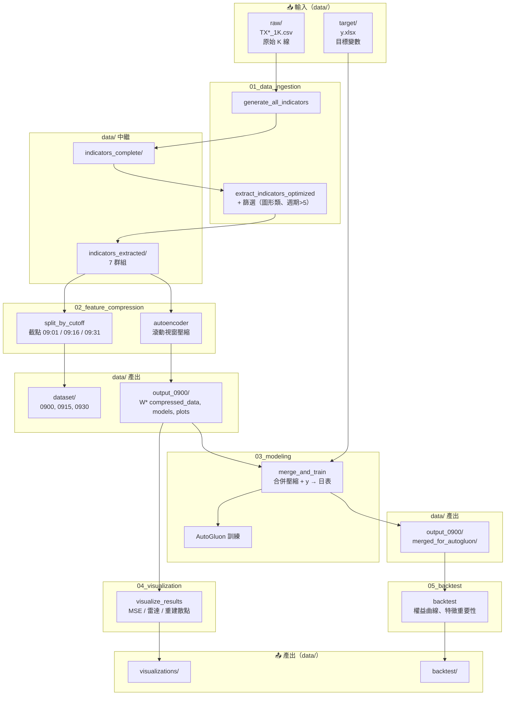

# Thesis-AutoGluon-TXF-Research

本專案為**台灣期貨市場（TXF）量化研究流程**：以盤前／早盤技術指標經 Autoencoder 滾動視窗壓縮後，合併為日頻特徵表，再以 AutoGluon 建模預測「截點至收盤」報酬率，並支援視覺化與回測。

---

## 總體流程圖



---

## 執行順序與依賴

| 步驟 | 模組 | 輸入（data/） | 產出（data/） |
|------|------|----------------|----------------|
| 1 | **01_data_ingestion** | `raw/`, 或既有 `indicators_complete/` | `indicators_complete/`, `indicators_extracted/` |
| 2 | **02_feature_compression** | `indicators_extracted/` | `dataset/0900|0915|0930/`, `output_0900/W*/`, `all_windows_results_*.json` |
| 3 | **03_modeling** | `output_0900/` 壓縮結果、`target/y.xlsx` | `output_0900/merged_for_autogluon/`, AutoGluon 模型 |
| 4 | **04_visualization** | `output_0900/`（JSON、W*） | `visualizations/` |
| 5 | **05_backtest** | `merged_for_autogluon/`, 預測結果 | `backtest/` |

**執行順序**：`01 → 02 → 03 → 04 → 05`（各腳本路徑由 `config.py` 統一指向 `data/`）。

---

## 目錄結構

```
Thesis-AutoGluon-TXF-Research/
├── config.py              # 路徑設定（DATA_ROOT = data/）
├── data/                   # 所有輸入與產出（見 data/README.md）
├── scripts/
│   ├── 01_data_ingestion/
│   ├── 02_feature_compression/
│   ├── 03_modeling/
│   ├── 04_visualization/
│   ├── 05_backtest/
│   └── utils/              # config 引用、plotting_engine
└── docs/
```

---

## 使用方式

1. **資料準備**：將原始 K 線放入 `data/raw/TX2011~20231222-1K/`，目標變數放入 `data/target/y.xlsx`（或 `y.csv`）。詳見 [data/README.md](data/README.md)。
2. **路徑覆寫**：若 `data/` 不在 repo 下，可設環境變數 `DATA_ROOT` 指向實際目錄（本機或 Colab 皆可）。
3. **依序執行**：進入各模組目錄執行對應腳本，或依 `scripts/README_scripts.md` 總覽執行。
