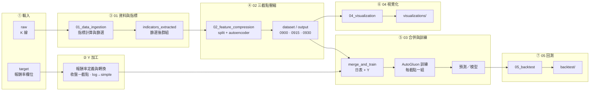

# Thesis-AutoGluon-TXF-Research

本專案為**台灣期貨市場（TXF）量化研究流程**：以盤前／早盤技術指標經 Autoencoder 滾動視窗壓縮後，合併為日頻特徵表，再以 AutoGluon 建模預測「截點至收盤」報酬率，旨在研究早盤走勢對於該時點到收盤之資訊含量。

---

## 總體流程圖

本流程**依三組截點（09:00 / 09:15 / 09:30）**分別產出 X 與 Y：特徵為「截點前」分鐘資料與壓縮結果，目標變數 Y 為**報酬率**（收盤－該截點），並在建模前做報酬率加工（如 log → simple）。



---

## 執行順序與依賴

**三組截點**：所有 X（特徵）與 Y（目標）皆依 **09:00、09:15、09:30** 三種截點分別產出；Y 為**報酬率**（收盤－該截點），會經 log → simple 加工後再與特徵合併。

| 步驟 | 模組 | 輸入（data/） | 產出（data/） |
|------|------|----------------|----------------|
| 1 | **01_data_ingestion** | `raw/`, 或既有 `indicators_complete/` | `indicators_complete/`, `indicators_extracted/`（共用） |
| 2 | **02_feature_compression** | `indicators_extracted/` | 三組：`dataset/0900`, `0915`, `0930/`；`output_0900`, `output_0915`, `output_0930/`（各含 W*） |
| 3 | **03_modeling** | 各截點之 `output_*/` 壓縮結果、`target/` 內**依截點之報酬率欄位**（如 afternoon_return_0900） | 三組：`merged_for_autogluon/`（0900, 0915, 0930），AutoGluon 模型 |
| 4 | **04_visualization** | 各截點 `output_*/`（JSON、W*） | `visualizations/`（可依截點分檔） |
| 5 | **05_backtest** | 各截點 `merged_for_autogluon/`、預測結果 | `backtest/`（可依截點評估） |

**執行順序**：`01 → 02 → 03 → 04 → 05`（各腳本路徑由 `config.py` 統一指向 `data/`）。

---

## 目錄結構

```
Thesis-AutoGluon-TXF-Research/
├── config.py              # 路徑設定（DATA_ROOT = data/）
├── data/                   # 所有輸入與產出（見 data/README.md）
├── scripts/
│   ├── 01_data_ingestion/
│   ├── 02_feature_compression/
│   ├── 03_modeling/
│   ├── 04_visualization/
│   ├── 05_backtest/
│   └── utils/              # config 引用、plotting_engine
└── docs/
```

---

## 使用方式

1. **依賴**：`pip install -r requirements.txt`（見根目錄 `requirements.txt`）。
2. **設定**：路徑由根目錄 `config.py` 統一管理；可設環境變數 `DATA_ROOT`、`PROJECT_ROOT` 覆寫。
3. **資料準備**：將原始 K 線放入 `data/raw/TX2011~20231222-1K/`，目標變數放入 `data/target/y.xlsx`（或 `y.csv`）。詳見 [data/README.md](data/README.md)。
4. **所有程式僅讀寫 data/**：各腳本一律從 `config` 取得路徑，輸入與產出皆在 `data/` 下，無其他目錄寫入。
5. **執行方式**（二擇一或並用）：
   - **手動單檔**：進入該模組目錄後直接執行，例如  
     `cd scripts/02_feature_compression && python split_by_cutoff.py`  
     各腳本與 data/ 的對應見 [scripts/README_scripts.md](scripts/README_scripts.md)。
   - **由 main 依序跑**：  
     `python main.py`（全流程）、`python main.py --step 2`（只跑步驟 2）、`python main.py --list`（列步驟）。
