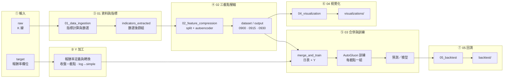

# Thesis-AutoGluon-TXF-Research

本專案為**台灣期貨市場（TXF）量化研究流程**：以盤前／早盤技術指標經 Autoencoder 滾動視窗壓縮後，合併為日頻特徵表，再以 AutoGluon 建模預測「截點至收盤」報酬率，旨在研究早盤走勢對於該時點到收盤之資訊含量。

---

## 總體流程圖

本流程**依三組截點（09:00 / 09:15 / 09:30）**分別產出 X 與 Y：特徵為「截點前」分鐘資料與壓縮結果，目標變數 Y 為**報酬率**（收盤－該截點），並在建模前做報酬率加工（如 log → simple）。



---

## 執行順序與依賴

**三組截點**：所有 X（特徵）與 Y（目標）皆依 **09:00、09:15、09:30** 三種截點分別產出；Y 為**報酬率**（收盤－該截點），會經 log → simple 加工後再與特徵合併。

| 步驟 | 模組 | 輸入（data/） | 產出（data/） |
|------|------|----------------|----------------|
| 1 | **01_data_ingestion** | `raw/`, 或既有 `indicators_complete/` | `indicators_complete/`, `indicators_extracted/`（共用） |
| 2 | **02_feature_compression** | `indicators_extracted/` | 三組：`dataset/0900`, `0915`, `0930/`；`output_0900`, `output_0915`, `output_0930/`（各含 W*） |
| 3 | **03_modeling** | 各截點之 `output_*/` 壓縮結果、`target/` 內**依截點之報酬率欄位**（如 afternoon_return_0900） | 三組：`merged_for_autogluon_0900/`、`_0915/`、`_0930/`（依截點後綴），AutoGluon 模型 |
| 4 | **04_visualization** | 各截點 `output_*/`（JSON、W*） | `visualizations/`（可依截點分檔） |
| 5 | **05_backtest** | 各截點 `merged_for_autogluon_*/`、預測結果 | `backtest/`（可依截點評估） |

**執行順序**：`01 → 02 → 03 → 04 → 05`（各腳本路徑由 `config.py` 統一指向 `data/`）。

---

## 目錄結構

```
Thesis-AutoGluon-TXF-Research/
├── config.py              # 路徑設定（DATA_ROOT = data/）
├── data/                   # 所有輸入與產出（見 data/README.md）
├── scripts/
│   ├── 01_data_ingestion/
│   ├── 02_feature_compression/
│   ├── 03_modeling/
│   ├── 04_visualization/
│   ├── 05_backtest/
│   └── utils/              # config 引用、plotting_engine
└── docs/
```

---

## 使用方式

1. **依賴**：`pip install -r requirements.txt`（見根目錄 `requirements.txt`）。
2. **設定**：路徑由根目錄 `config.py` 統一管理；可設環境變數 `DATA_ROOT`、`PROJECT_ROOT` 覆寫。
3. **資料準備**：將原始 K 線放入 `data/raw/TX2011~20231222-1K/`，目標變數放入 `data/target/y.xlsx`（或 `y.csv`）。詳見 [data/README.md](data/README.md)。
4. **所有程式僅讀寫 data/**：各腳本一律從 `config` 取得路徑，輸入與產出皆在 `data/` 下，無其他目錄寫入。
5. **執行方式**（二擇一或並用）：
   - **手動單檔**：進入該模組目錄後直接執行，例如  
     `cd scripts/02_feature_compression && python split_by_cutoff.py`  
     各腳本與 data/ 的對應見 [scripts/README_scripts.md](scripts/README_scripts.md)。
   - **由 main 依序跑**：  
     `python main.py`（全流程）、`python main.py --step 2`（只跑步驟 2）、`python main.py --list`（列步驟）。

---

## 研究紀錄

以下為開發過程中遇到的問題、心得與改進方式，供日後重現與避免重蹈覆轍。

### 4.1 Autoencoder／壓縮特徵「偷看未來」（資料洩漏）

- **問題**：若用「全時段」資料一次訓練 autoencoder，再對所有年份做壓縮，等於用**未來資訊**來壓縮過去日期的特徵；合併後交給 AutoGluon 預測時，模型會間接用到未來資訊，結果不公正（尤其 MACD 等技術指標壓縮值會帶有洩漏）。
- **改進**：
  - **02_feature_compression** 改為**滾動視窗**：每個窗口「前 2 年訓練、第 3 年壓縮」（如 W1：2011–2012 訓練 → 2013 壓縮；W2：2013–2014 訓練 → 2015 壓縮），訓練時絕不使用該壓縮年之後的資料。
  - **03_modeling** 合併時**依年對齊**：每日只取「該日所屬年份」對應窗口的壓縮特徵（例如 2013 年某日只用 W1 的壓縮，2014 年只用 W2），不混用窗口，避免任何未來資訊進入特徵。

### 4.2 目標變數與訓練用表

- **Y**：使用「收盤－截點」報酬率（如 afternoon_return_0900）；若來源為 log 報酬，03 會轉成 simple return 再寫入 `target_return`。
- **訓練時**：合併表產出後，訓練 AutoGluon 前會 **drop 日期欄**（以及僅用截點前分鐘彙總），避免時間本身被當成特徵造成洩漏。

### 4.3 特徵清理與壓縮專一

- 合併階段會做常數欄、低變異、二元型態等清理，並可設定**只保留壓縮特徵、剔除原始技術指標欄**（`DROP_ORIGINAL_INDICATORS`），讓模型只吃壓縮後的彙總，不重複使用原始指標。

### 4.4 路徑與重現性

- 所有輸入與產出**僅在 data/**，由 `config.py`（及可選的 `DATA_ROOT`）統一管理，方便本機／Colab 或不同機器重現；整個 `data/` 不進版控，僅 data/README 被追蹤。

### 4.5 為什麼刪除部分技術指標（精簡特徵）

- **CDL 蠟燭圖形態（61 個）**：以 `CDL` 開頭的 TA-Lib 圖形識別指標為**二元或三元離散**（常為 0 / 100 / -100），在機器學習中效果不佳且欄位過多；刪除後欄位由約 369 降至 308。
- **常數／高缺失／索引類**：常數或幾乎常數、長週期在單日分鐘資料下缺漏嚴重；索引類（MAXINDEX_*、MININDEX_*）表示極值**位置**而非價格／趨勢，預測幫助有限。
- **週期過長欄位**：單日僅約 301 筆分鐘，過長週期指標易缺值或無意義，故只保留要壓縮的 7 群組（且多為 14／20 週期）。
- **策略取捨**：採「保守刪除」：先刪明顯無用（CDL、常數、高缺失、索引類），其餘讓模型或後續特徵選擇決定。

### 4.6 壓縮結果未寫回與合併閉環

- **問題**：早期單一視窗版只產出 autoencoder 模型與 plots，**compressed_data 未系統性寫回**，「步驟 3：合併壓縮特徵回完整資料」一直尚未完成。
- **解法**：改為**滾動視窗**（02 每窗產出 W*/compressed_data/），並在 03 中實作「依 compress_year 載入對應 W*、按日／年對齊後併入日表」，形成完整閉環。

### 4.7 時間序列切分與評估（會議／文獻要點）

- **交叉驗證**：一般 K 折假設樣本 iid，時間序列會違反；應採用**時間序列切分**或 **rolling / expanding window** 的驗證方式，避免未來資訊進入訓練。
- **比例**：訓練／驗證／測試可採 80/10/10 或固定筆數；小資料常用 60/20/20。
- **評估指標**：除 accuracy 外，建議用 **Sharpe ratio**、**F1** 等更貼近實務的指標；AutoGluon 可自訂 eval_metric。
- **模型比較**：不同模型需做**統計檢定**或明確比較，並在論文中說明為何選用某些模型（文獻支持、實證結果）。

### 4.8 特徵重要性與共線性

- **問題**：特徵重要性若採「移除單一特徵看表現」時，若存在**高度相關**的特徵，移除其一可由另一補上，導致重要性被低估或失真。
- **做法**：先做相關性／Spearman 分析，必要時用主成分或因素分析萃取；IC test／Spearman 與機器學習特徵重要性可並存，不必一致，但需在論文中說明取捨理由。

### 4.9 明確排除的洩漏欄位

- 下列欄位**不得**進入模型（會洩漏未來）：**P_close**（收盤價）、**P_0900 / P_0915 / P_0930**（該時點價格）、**close_return**（全日報酬）。僅能使用「截點前」的價格與報酬、以及「截點至收盤」的目標 Y。

### 4.10 研究心得（早盤與午盤、條件式有效）

- **早盤與午盤相關性**：曾因樣本自相關導致初版結果不可信；重做後發現早盤與午盤的**線性相關並不高**，需結合多特徵與非線性模型。
- **顯著因子**：昨日美股報酬、開盤缺口較顯著；在**前一交易日台股大跌**等特定 regime 下，昨日美股與午盤呈更強負相關。
- **技術分析條件式有效**：技術訊號往往僅在**特定市場狀態**下有效，關係具非線性與交互；故以 AutoML 系統性檢驗特徵資訊含量與策略可行性。
- **特徵重要性實證**：美股前日、缺口最重要；早盤波動次之；單純成交量／VWAP／早盤漲跌幅在部分設定下幾乎無效。

### 4.11 資料散落、格式與 y 對齊

- **散落與路徑**：歷史資料曾分散於多個日期資料夾；且存在 Windows 絕對路徑，搬遷或跨機器需改為 config 或環境變數。
- **格式**：現行流程統一為 CSV 與固定檔名 pattern。
- **y 與日表合併**：y.xlsx 的 **day_id**（YYYYMMDD 整數）與日表的 **date** 型別不一致會導致 merge 失敗。解法：讀取 y 時將 day_id 轉成標準日期再合併；並將 log 報酬轉成 simple。

### 4.12 Keras 模型載入與 Colab 路徑

- **載入已存 Keras 模型**時若出現「無法解析 mse / 找不到 metric」：在 `load_model` 時傳入 **custom_objects**（如 `mse`、`mean_squared_error`），若仍失敗可改為 **compile=False** 載入。
- **Colab**：部分流程曾在 Google Colab 執行，路徑為 Google Drive；本機重跑需改為本機 data/ 或 config 路徑；Colab 版參數需與本地 02_autoencoder 保持一致。
