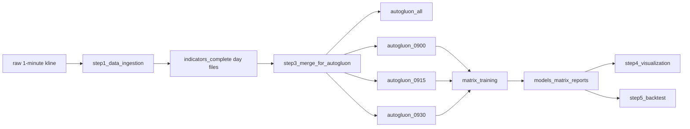

# Thesis-AutoGluon-TXF-Research v2.0

本版本為研究流程重構版：主流程改為「原始資料 -> 指標日檔 -> cutoff 寬表 -> matrix 訓練評估」，並將 Autoencoder 路線降級為 Legacy 參考。

## 1. v2.0 核心變更

- 主流程改為 `01_data_ingestion -> 03_modeling -> 04_visualization -> 05_backtest`。
- `02_feature_compression` 保留為 Legacy，不再是 `main.py` 的必要步驟。
- `03_modeling` 新增 `merge_for_autogluon.py`，直接由 `indicators_complete` 產出 `autogluon/all|0900|0915|0930`。
- 導入 matrix 訓練框架（`colab_train_matrix_core.py` + `train_matrix_*.ipynb` + runbook）。
- README 與腳本說明改為以 v2.0 流程為主，避免舊路徑誤用。

## 2. 研究問題與方法對齊

研究主題：
- 早盤不同截點（`0900`、`0915`、`0930`）是否可有效預測截點到收盤報酬。
- 不同訓練目標（預設/Sharpe）、模型家族（Tabular/TimeSeries）與特徵集（full/premarket3）下，樣本外表現差異。

v2.0 方法：
- 輸入特徵採五大面向（跨日、量價、波動、動能、趨勢）。
- Step 3 先產出每日寬表，再以 matrix 框架做 rolling 訓練與測試。
- 每個 cutoff 均有獨立資料檔與結果，避免路徑硬綁 `0900`。

## 3. v2.0 流程圖


```mermaid
flowchart LR
    raw1mKline[raw 1-minute kline] --> step1Ingestion[step1_data_ingestion]
    step1Ingestion --> indicatorsComplete[indicators_complete day files]
    indicatorsComplete --> step3Merge[step3_merge_for_autogluon]
    step3Merge --> autoAll[autogluon_all]
    step3Merge --> auto0900[autogluon_0900]
    step3Merge --> auto0915[autogluon_0915]
    step3Merge --> auto0930[autogluon_0930]
    auto0900 --> matrixTrain[matrix_training]
    auto0915 --> matrixTrain
    auto0930 --> matrixTrain
    matrixTrain --> reports[models_matrix_reports]
    reports --> step4Viz[step4_visualization]
    reports --> step5Backtest[step5_backtest]
```

## 4. 目錄與責任

```text
Thesis-AutoGluon-TXF-Research/
├── config.py
├── main.py
├── README.md
├── CHANGELOG.md
├── data/
│   ├── raw/
│   ├── indicators_complete/
│   ├── indicators_extracted/
│   ├── autogluon/
│   │   ├── all/
│   │   ├── 0900/
│   │   ├── 0915/
│   │   └── 0930/
│   ├── models/
│   │   └── matrix_runs/
│   ├── visualizations/
│   └── backtest/
├── docs/
└── scripts/
    ├── 01_data_ingestion/
    ├── 02_feature_compression/   # Legacy
    ├── 03_modeling/
    ├── 04_visualization/
    └── 05_backtest/
```

## 5. 執行順序（研究主線）

建議順序：
1. `python main.py --step 1`
2. `python main.py --step 3`
3. 進 Colab 跑 `scripts/03_modeling/train_matrix_0900.ipynb`
4. 進 Colab 跑 `scripts/03_modeling/train_matrix_0915.ipynb`
5. 進 Colab 跑 `scripts/03_modeling/train_matrix_0930.ipynb`
6. 視需求跑 `scripts/03_modeling/train_matrix_premarket3.ipynb`
7. `python main.py --step 4`
8. `python main.py --step 5`

說明：
- `main.py --step 2` 會顯示 Legacy 並跳過。
- 路徑由 `config.py` 統一管理，可用 `PROJECT_ROOT`、`DATA_ROOT` 覆寫。

## 6. matrix 訓練框架（v2.0）

核心檔案：
- `scripts/03_modeling/colab_train_matrix_core.py`
- `scripts/03_modeling/COLAB_MATRIX_RUNBOOK.md`
- `scripts/03_modeling/train_matrix_0900.ipynb`
- `scripts/03_modeling/train_matrix_0915.ipynb`
- `scripts/03_modeling/train_matrix_0930.ipynb`
- `scripts/03_modeling/train_matrix_premarket3.ipynb`

主要設定：
- `train_years_list = [2, 3, 5]`
- cutoff：`0900`、`0915`、`0930`
- 特徵集：`full`、`premarket3`
- 實驗組合（full）：tabular default/rmse、tabular sharpe/sharpe、timeseries default/rmse、timeseries default/sharpe

固定輸出：
- `data/models/matrix_runs/reports/{feature_set}/run_summary.xlsx`
- `comparison_by_metric.xlsx`
- `comparison_tabular_vs_timeseries.xlsx`
- `rolling_year_detail.xlsx`
- `signal_performance.xlsx`
- `feature_importance_pack.xlsx`
- `summary_all_configs.xlsx`

## 7. Legacy 邊界（保留但非主線）

以下保留作歷史研究重現，不建議作 v2.0 主流程：
- `scripts/02_feature_compression/*`
- `scripts/03_modeling/merge_and_train.py`
- `scripts/03_modeling/merge_output2_for_autogluon.py`
- `scripts/03_modeling/build_uncompressed_autogluon.py`

## 8. 核對清單（你可直接對照研究需求）

### 已完成對齊
- [x] 主流程已從 AE 導向改為 Step 3 寬表導向。
- [x] 三截點資料輸出統一在 `data/autogluon/{cutoff}`。
- [x] matrix 訓練核心與 runbook 已納入版本。
- [x] `main.py` 已把 Step 2 定義為 Legacy。

### 待你核對（v2.0 出版前）
- [ ] `data/raw`、`data/indicators_complete`、`data/autogluon/*` 是否齊全。
- [ ] `target_return` 計算口徑是否符合你論文定義（simple return）。
- [ ] `scripts/04_visualization` 與 `scripts/05_backtest` 的輸入路徑是否已全改為新主線輸出。
- [ ] matrix 實驗組合是否完全符合你的最終比較設計（full/premarket3、tabular/timeseries、default/sharpe）。
- [ ] 研究章節文件（第五節）與實際腳本命名是否一致。

## 9. 目前已知問題（尚未完全修復）

- 部分文件仍可能殘留舊流程用語（例如 `merge_and_train.py`、`output_0900` 單一路徑）。
- `docs/第五節_自動化機器學習建構與優化.md` 仍描述部分舊版 `autogluon_ready_uncompress` 敘述，若作為最終論文章節請再與 v2.0 路徑做最終一致化。
- `data/README.md`、`data/models/README.md` 曾被刪除，v2.0 建議恢復，避免再發生「少放資料」。
- 舊 notebook 名稱在少數文件仍可能被引用，需要逐檔排查。
- `scripts/04_visualization/visualize_results.py` 與 `scripts/05_backtest/backtest.py` 仍可能有舊輸入路徑邏輯，正式出稿前建議做一次全路徑 smoke test。

## 10. 安裝與快速開始

```bash
pip install -r requirements.txt
python main.py --list
python main.py --step 1
python main.py --step 3
```

接著依 `scripts/03_modeling/COLAB_MATRIX_RUNBOOK.md` 執行 matrix notebook。
